# python-django-shop

Online shop which built by Django and construct with uWSGI, Nginx and Docker. It contains enrich functions for e-commerce website like shop, cart, etc.


## Techniques

| Part            | Technique                       |
| --------------- | ------------------------------- |
| Frontend        | HTML, CSS, jQquery, Bootstrap 5 |
| Backend         | Django                          |
| Database        | PostgreSQL                      |
| Deploy          | Nginx, uWSGI, Docker, AWS EC2   |
| Version Control | git                             |
| Email Sending   | Celery, Redis                   |


## Go live
Under local environment, use `docker-compose-dev.yml` to set up the project.
```docker
git clone https://github.com/ycy-tw/python-django-shop.git
cd python-django-shop
docker-compose -f docker-compose-dev.yml up -d
docker-compose -f docker-compose-dev.yml exec web python load_data.py
```

Visit http://127.0.0.1/, login with accounts below to try out.

| email             | password     | level |
| ----------------- | ------------ | ----- |
| user1@example.com | testing12345 | -     |
| admin@example.com | testing12345 | admin |


## Screenshots

### home
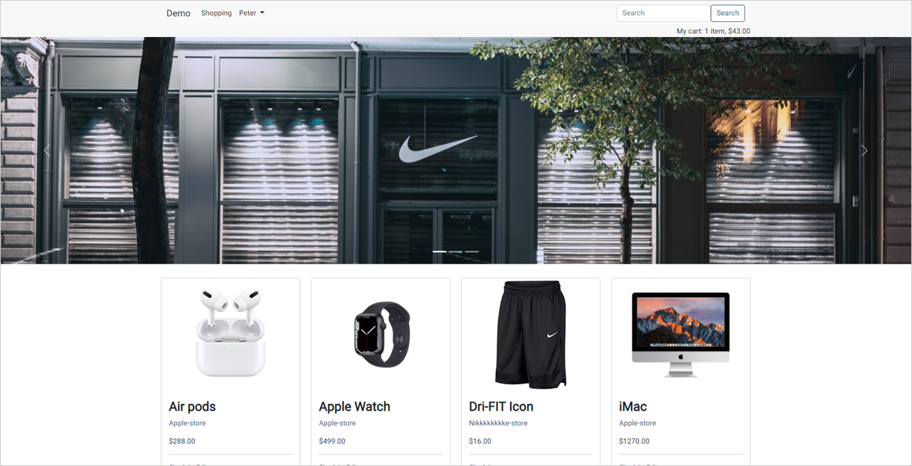

### Product detail
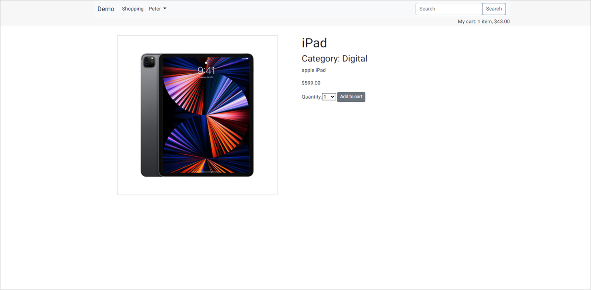

### Shop detail
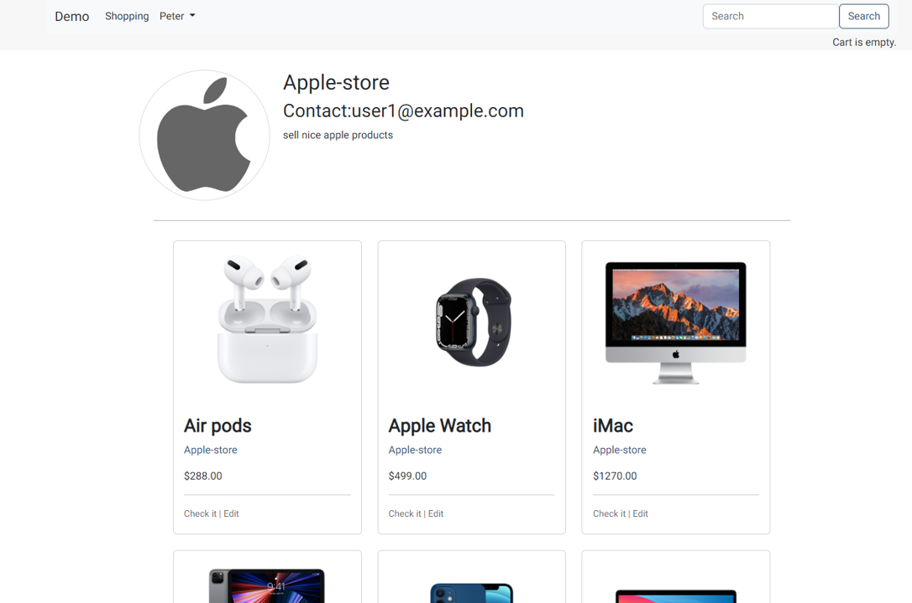

### Cart
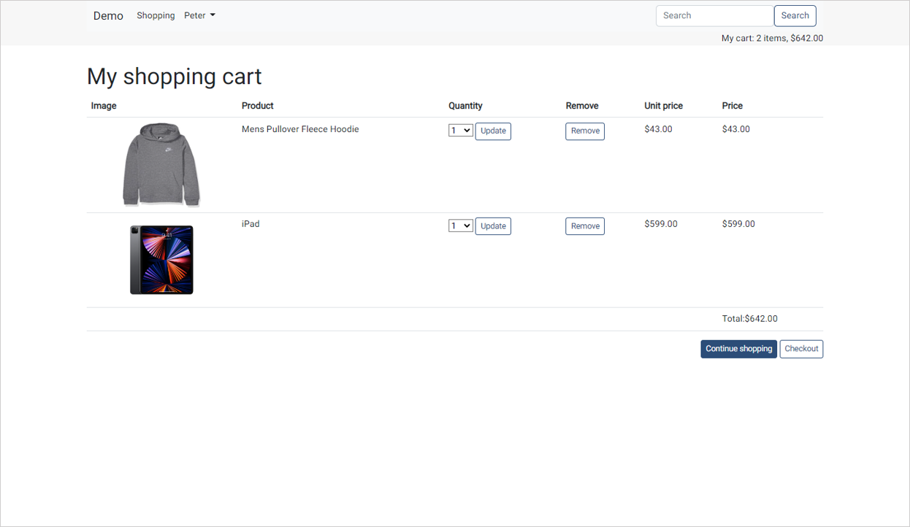

### Checkout
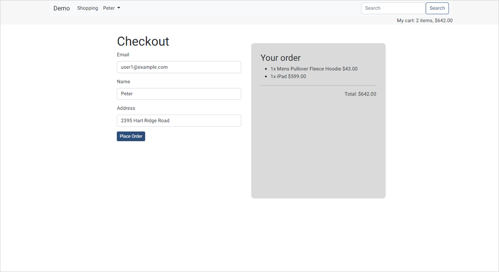

### Product List
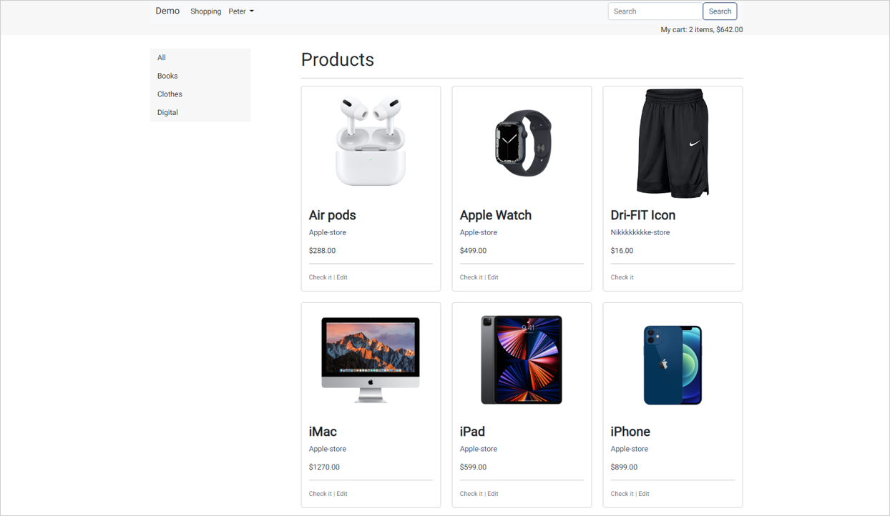

### Product Form
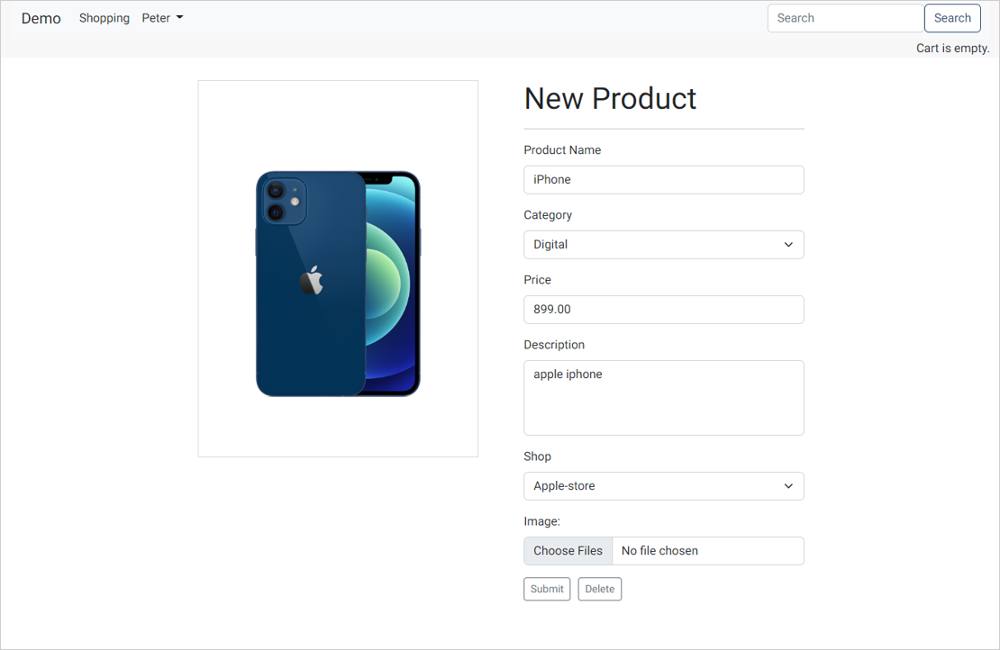

### Shop Form
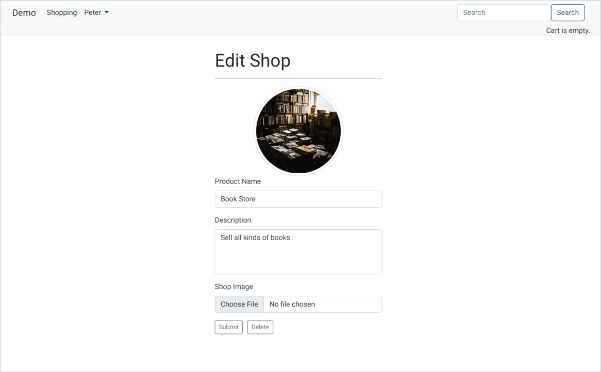

### Edit user
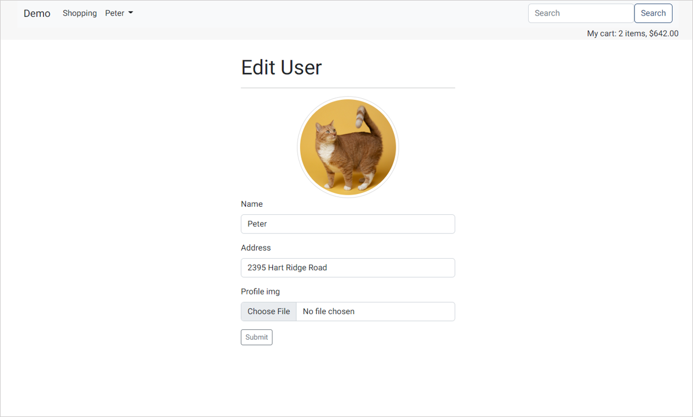

### User shop
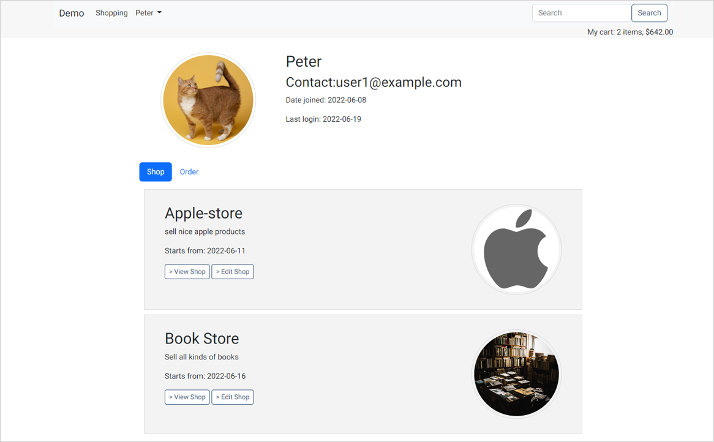

### User order
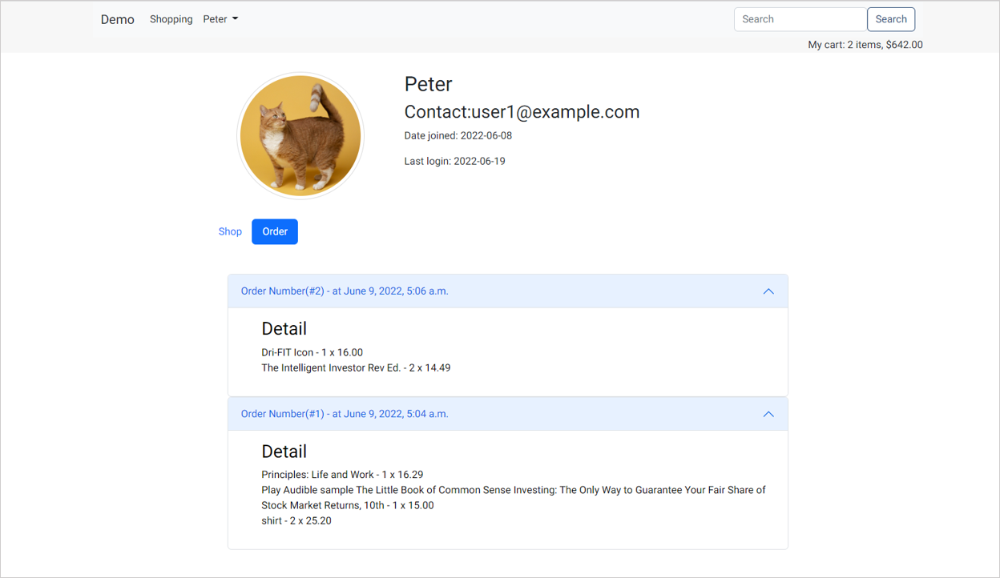

### Search
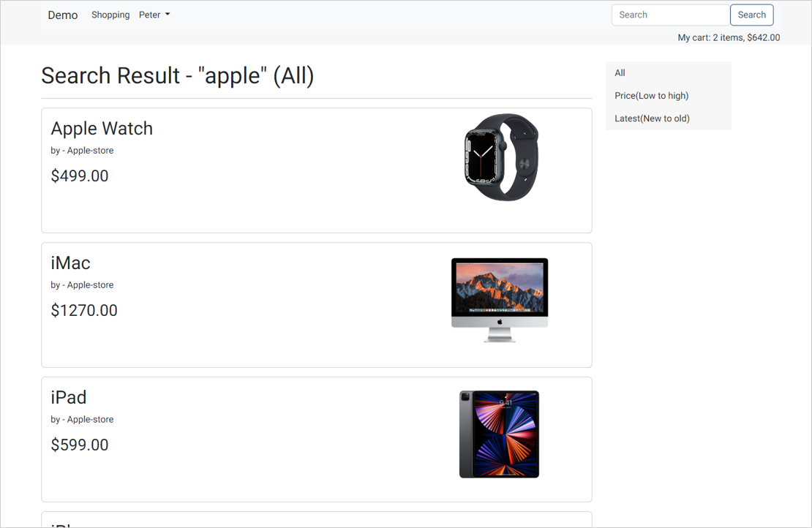

### Login


## References

- [Django 3 By Example: Build powerful and reliable Python web applications from scratch, 3rd Edition](https://www.amazon.com/Django-Example-powerful-reliable-applications/dp/1838981950/ref=sr_1_5?crid=3GW5HFEDDLFB3&keywords=django&qid=1655733334&sprefix=django%2Caps%2C356&sr=8-5)
- [Deploying Django with Docker Compose](https://www.youtube.com/watch?v=mScd-Pc_pX0&ab_channel=LondonAppDeveloper)
- [docker-django-nginx-uwsgi-postgres-tutorial](https://github.com/twtrubiks/docker-django-nginx-uwsgi-postgres-tutorial)
